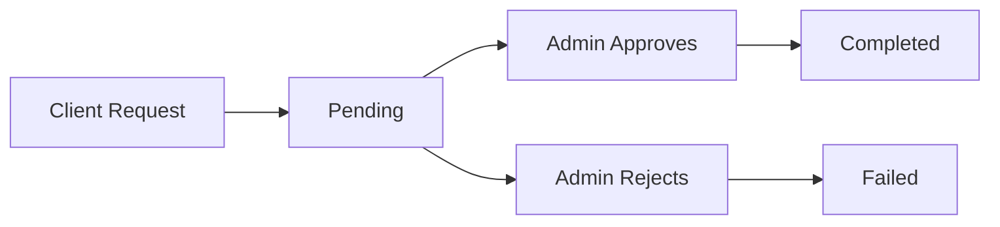

# TEG Transfer / Wallet System API - Integration Guide

## Overview

A comprehensive fintech API for client wallet management with secure transaction flows including deposits, withdrawals, and purchases - all requiring admin approval for fund movements.

**Base URL**: `https://api.teg-wallet.net/v1`  
**Authentication**: JWT Bearer Token  
**Response Format**: Standardized JSON with `success`, `data`, `message`, and `validationErrors` fields

```json
{
  "success": boolean,
  "data": object | null,
  "message": string,
  "validationErrors": string[]
}
```

---

## 🚀 Quick Start

### 5-Minute Integration

1. **Create Client** → Get client ID and wallet
2. **Deposit Funds** → Requires admin approval
3. **Check Balance** → Verify available funds
4. **Make Purchases** → Reserve funds for services
5. **Withdraw Funds** → Request cash disbursement

### Example Workflow

```javascript
// 1. Create client
const client = await createClient({
  email: "user@example.com",
  phoneNumber: "+1234567890",
  firstName: "John",
  lastName: "Doe",
});

// 2. Deposit funds (requires approval)
const deposit = await depositFunds(client.id, {
  amount: 1000.0,
  currencyCode: "XOF",
  description: "Initial deposit",
});

// 3. Check balance
const balance = await getBalance(client.id);

// 4. Make purchase
const purchase = await reservePurchase(client.id, {
  purchaseAmount: 500.0,
  serviceFeeAmount: 25.0,
  description: "Service payment",
});

// 5. Withdraw funds (requires approval)
const withdrawal = await withdrawFunds(client.id, {
  amount: 200.0,
  description: "Cash needs",
});
```

### Authentication

All endpoints require JWT Bearer token authentication.

```http
Authorization: Bearer {your_jwt_token}
```

### Client Management

**Create Client**

```http
POST /api/clients
```

**_Request:_**

```json
{
  "email": "client@example.com",
  "phoneNumber": "+1234567890",
  "firstName": "John",
  "lastName": "Doe",
  "currencyCode": "XOF"
}
```

**_Response:_**

```json
{
  "isSuccess": true,
  "data": {
    "id": "a1b2c3d4-1234-5678-9abc-123456789abc",
    "email": "client@example.com",
    "phoneNumber": "+1234567890",
    "firstName": "John",
    "lastName": "Doe",
    "status": "Active",
    "createdAt": "2024-01-15T10:30:00Z",
    "wallet": {
      "id": "b2c3d4e5-2345-6789-0bcd-234567890bcd",
      "balance": 0.0,
      "availableBalance": 0.0,
      "currencyCode": "XOF"
    }
  }
}
```

#### Automatic Actions:

✅ Wallet created automatically  
✅ Default currency set  
✅ Client status set to "Active"

### Client Status Values

**Active** – Can perform transactions

**Suspended** – Temporarily blocked

**Inactive** – Permanently deactivated

## Wallet & Balance

### Get Wallet Balance

```http
GET /api/wallet/{clientId}/balance
```

**_Response:_**

```json
{
  "isSuccess": true,
  "data": {
    "walletId": "guid",
    "clientId": "guid",
    "totalBalance": 1500.0,
    "availableBalance": 1200.0,
    "pendingBalance": 300.0,
    "currencyCode": "XOF",
    "status": "Healthy",
    "lastUpdated": "2024-01-15T10:30:00Z"
  }
}
```

### Get Detailed Wallet

```http
GET /api/wallet/{clientId}
```

**_Response:_**

```json
{
  "isSuccess": true,
  "data": {
    "id": "guid",
    "clientId": "guid",
    "balance": 1500.0,
    "availableBalance": 1200.0,
    "currencyCode": "XOF",
    "createdAt": "2024-01-15T10:30:00Z",
    "updatedAt": "2024-01-15T14:30:00Z",
    "status": "Active",
    "recentTransactions": [
      {
        "id": "guid",
        "type": "Deposit",
        "amount": 1000.0,
        "status": "Completed",
        "timestamp": "2024-01-15T10:30:00Z"
      }
    ],
    "activeReservations": [
      {
        "id": "guid",
        "purchaseAmount": 300.0,
        "status": "Pending",
        "createdAt": "2024-01-15T12:30:00Z"
      }
    ]
  }
}
```

### Check Balance Sufficiency

```http
POST /api/wallet/{clientId}/balance/check-sufficiency
```

**_Request:_**

```json
{
  "amount": 500.0,
  "currencyCode": "XOF"
}
```

**_Response:_**

```json
{
  "isSuccess": true,
  "data": {
    "isSufficient": true,
    "availableBalance": 1200.0,
    "requiredAmount": 500.0,
    "difference": 700.0,
    "message": "Sufficient balance available"
  }
}
```

### Get Balance History

```http
GET /api/wallet/{clientId}/balance/history?fromDate=2024-01-01&toDate=2024-01-31&period=Daily
```

### Query Parameters

- **fromDate**, **toDate**: Date range (defaults to last 30 days)
- **period**: Hourly, Daily, Weekly, Monthly

## Deposit Flow

### Process Overview



**1. Request Deposit**

```http
POST /api/wallet/{clientId}/deposit
```

**_Request:_**

```json
{
  "amount": 1000.0,
  "currencyCode": "XOF",
  "reference": "BANK_TRANSFER_001",
  "description": "Initial deposit"
}
```

**_Response:_**

```json
{
  "isSuccess": true,
  "data": {
    "id": "c3d4e5f6-3456-7890-cdef-34567890cdef",
    "walletId": "b2c3d4e5-2345-6789-0bcd-234567890bcd",
    "type": "Deposit",
    "amount": 1000.0,
    "currencyCode": "XOF",
    "status": "Pending",
    "description": "Initial deposit",
    "reference": "BANK_TRANSFER_001",
    "timestamp": "2024-01-15T10:30:00Z"
  }
}
```

#### Immediate effect:

✅ Balance increases by deposit amount  
❌ No AvailableBalance change - Funds not available until approved  
✅ Transaction status: **Pending**

**2. Approve Deposit (Admin)**

```http
POST /api/wallet/{clientId}/deposit/approve
```

**_Request:_**

```json
{
  "ledgerId": "c3d4e5f6-3456-7890-cdef-34567890cdef",
  "approvedBy": "admin_user"
}
```

**_Response:_**

#### Effect:

✅ Available balance increases by deposit amount  
✅ Transaction status: **Pending** → **Completed**

**3. Reject Deposit (Admin)**

```http
POST /api/wallet/{clientId}/deposit/reject
```

**_Request:_**

```json
{
  "ledgerId": "c3d4e5f6-3456-7890-cdef-34567890cdef",
  "reason": "Bank transfer not received",
  "rejectedBy": "admin_user"
}
```

**_Response:_**

#### Effect:

❌ No balance change  
✅ Transaction status: **Pending** → **Failed**
